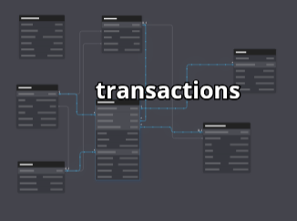
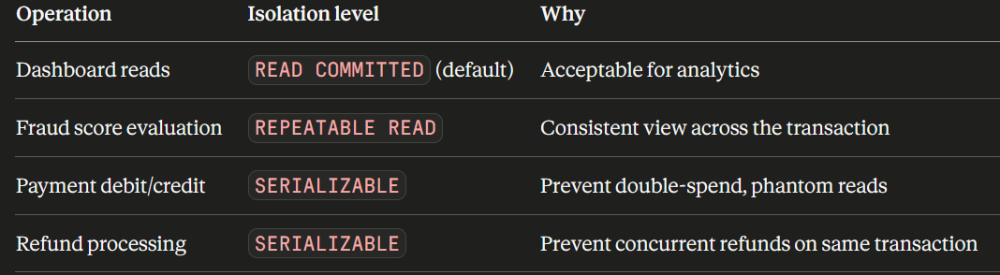
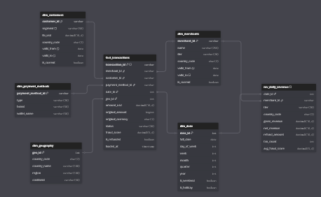
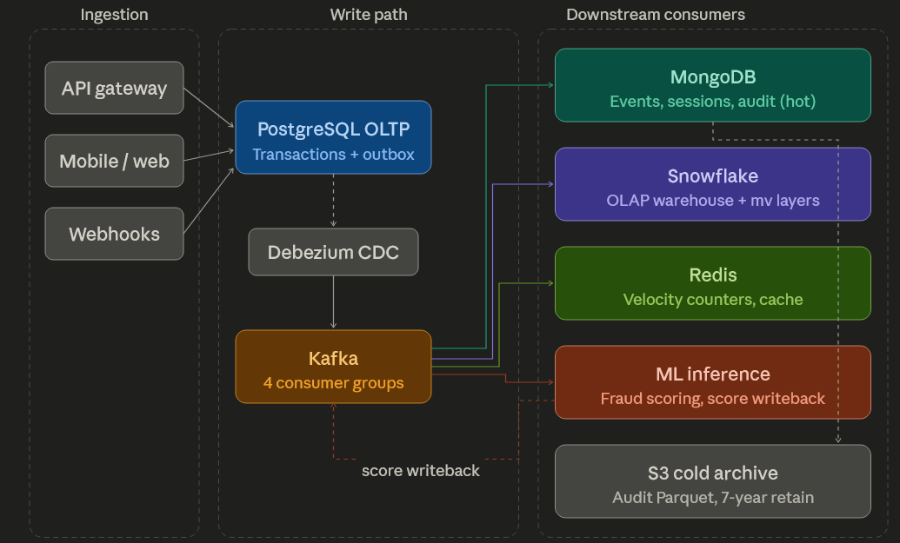
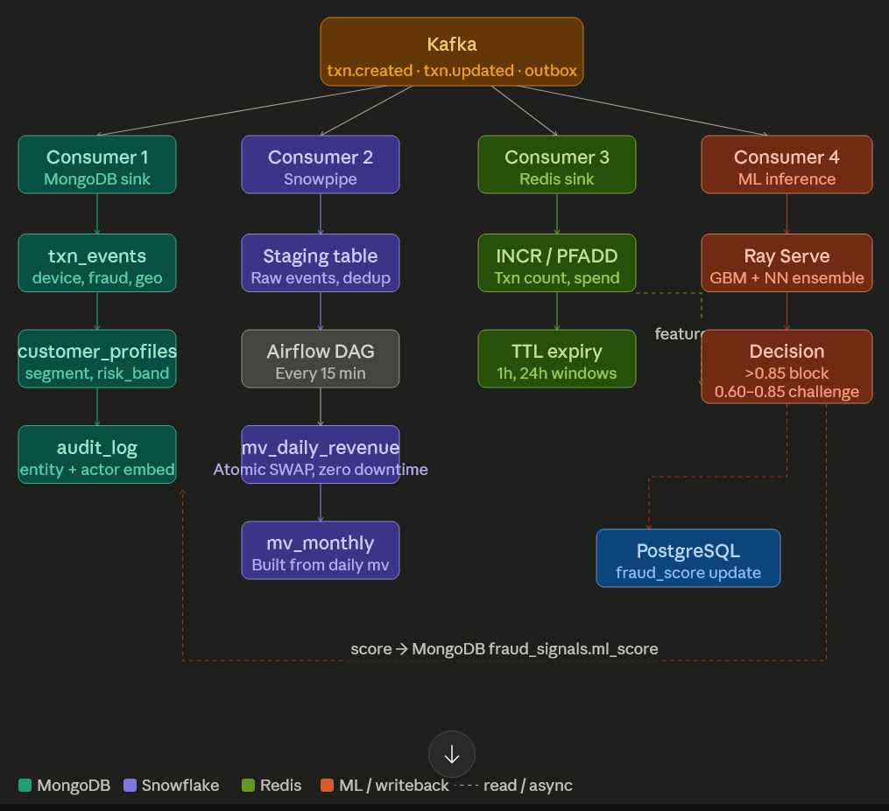
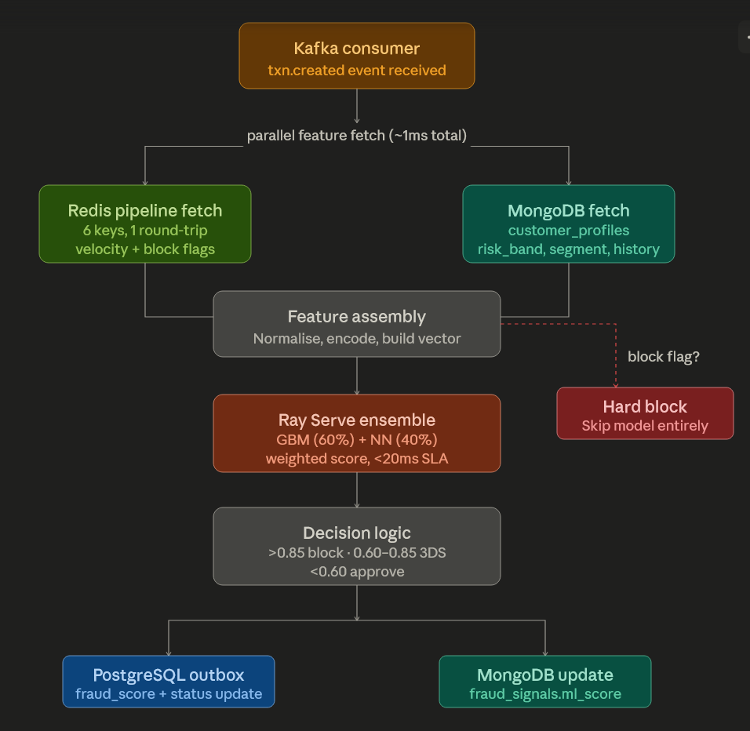
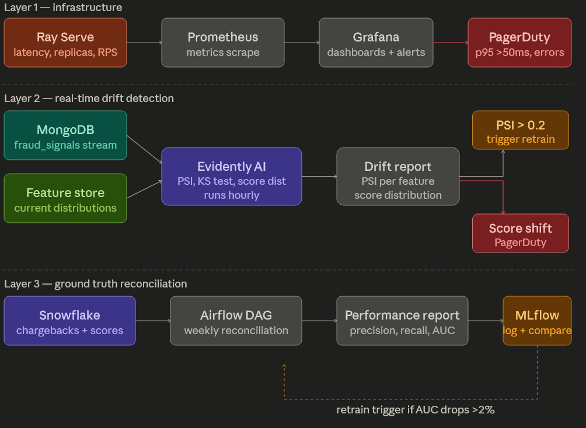

# Stripe Project - Strategy and decision explanation

## OLTP Data Model

### Ensuring ACID properties

Atomicity

enforced through the use of a "BEGIN/COMMIT"
to force all the actions in parallel (e.g. table update + insert into table, for example)

Consistency

use of "ADD CONSTRAINT" to ensure the value added to the tables are correct and follow the rules.

Isolation

the isolation level can be specified during transaction, depending on the transaction type:

-- Default (READ COMMITTED) — UNSAFE for Stripe's fraud scoring
-- A concurrent update to fraud_score between your two reads gives inconsistent data

-- For fraud checks and balance reads: use REPEATABLE READ
BEGIN TRANSACTION ISOLATION LEVEL REPEATABLE READ;
  SELECT fraud_score, status FROM transactions WHERE id = $1;
  -- ... fraud evaluation logic ...
  UPDATE transactions SET status = 'blocked' WHERE id = $1 AND status = 'pending';
COMMIT;

-- For financial debit/credit operations: use SERIALIZABLE
BEGIN TRANSACTION ISOLATION LEVEL SERIALIZABLE;
  SELECT balance FROM merchant_accounts WHERE id = $1 FOR UPDATE;
  -- FOR UPDATE places a row-level lock — no other transaction can modify this row
  UPDATE merchant_accounts SET balance = balance - $2 WHERE id = $1;
COMMIT;

Durability

Base is automatically covered through PostgreSQL's WAL.
But synchronous commits must be configured specifically for distributed/replicated setup.
Additionally, must handle failover

## OLAP Data Model

### Handling requests

The Star schema is used in order to limit the joins necessary during large queries. When a large-scale join occurs, it is handle with Clustering keys and Search optimization. Additionally, the use of small dimensions (<10 distinct types) and a large fact table allows for an easier broadcasting across nodes.

Subqueries can be handled through the use of Common Table Expressions (CTE) which are evaluated once and materialized. 

Time-series can be handled using Window functions, which "self-join" the table to avoid multiple passages.

### Optimizing query performance

The queries can be optimized by pre-aggregating the raw data at various intervals: 
hourly for fraud detections (last 48h max), 
daily for daily revenues,
monthly for "long term" analysis.

In order to prevent downtime, an atomic swap can be performed using a "staging" table to build the refreshed version without impacting production. 
Alternatively, a Dynamic table could be used if a recent version of snowflake is available/used.

## NoSQL

The structure should be a document-based database, used for its flexibility based on the main way/reason they are accessed.

The IDs used in the OLTP database are reused in the NoSQL database to ensure transversality across the databases. 

### Collections

Three collections are used:

- transaction_events: 
(embedded device + fraud signals): reference entities (customer and merchants) and embed small context (rate at transaction, device, geo, fraud_signals, etc.)
- customer_profiles: 
embedded, updated by ML pipeline
- user_sessions: 
Embed events, reference session chain, create new child document when even_count hits 100
- ml_features:
embedded features, reference to prior versions
- audit_log:
Fully embedded, with before/after state of transaction, and a TTL to suppress the log after X days in MongoDB and push it to S3

## Data pipeline and architecture

Data are written in an OLTP base, which also populate an outbox_events table. That table will be used by CDC-Debezium to feed Kafka which will handle the load for the multiple downstream services.

Kafka will distribute data to the MongoDB and Snowflake, as well as using Redis for the cache. It will also trigger the ML inference system.

## Security and Compliance plan

Encryption is put in place for all elements, especially for paiement information. The accesses are given only when necessary.
The logs are collected in an immutable way, with no possibility to delete them for a period of time. the infrastructure, threats and data quality are considered as three separate patterns to specialise each tool. 

Overall, everything is made to comply to the legal requirements (GDPR, CCPA and PCI-DSS)

## Machine learning integration strategy

The ML inference will fetch data from Redis and MongoDB in order to be first analyzed through critical threshold (e.g. 20 transaction in 10 minutes) that would directly flag the transaction as a fraud.
Otherwise it goes through the model and is analyzed, before updating PostgreSQL outbox and MongoDB update (fraud_score)

Performance monitoring in three acts:
- Check infra performance (ensure low latency on inference)
- Check real-time drift with EvidentlyAI, trigger retrain if PSI too high
- Check model precision: compares decision to truth (chargebacks are wrong  decisions). If too many chargebacks => triggers retraining

